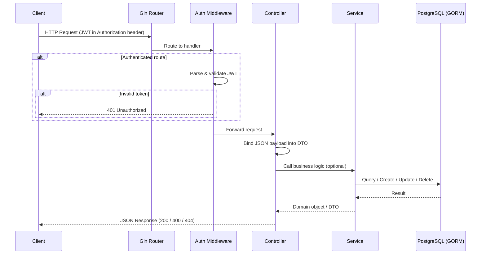
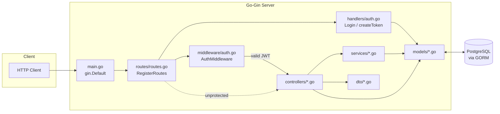
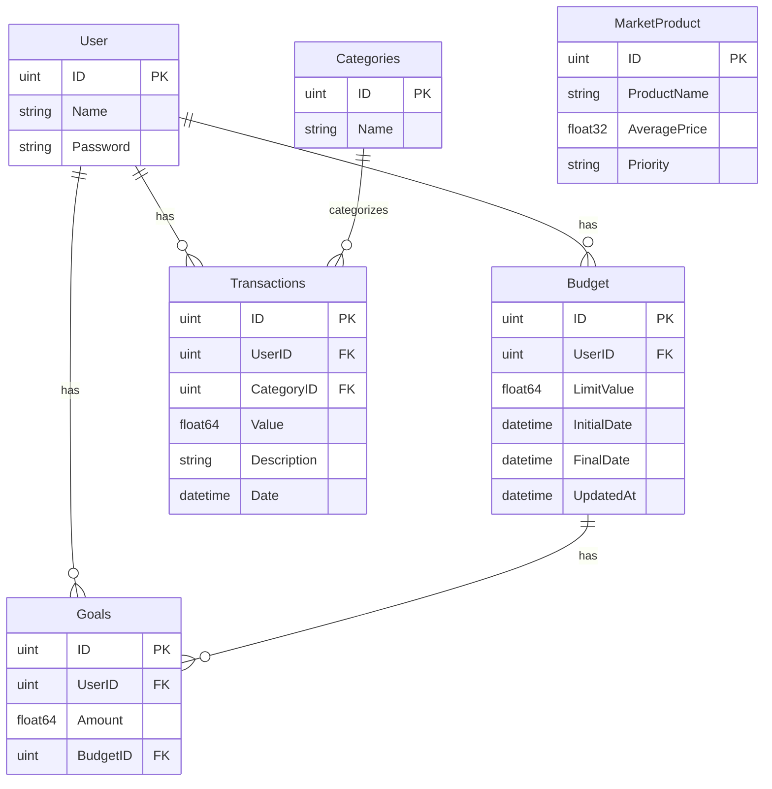
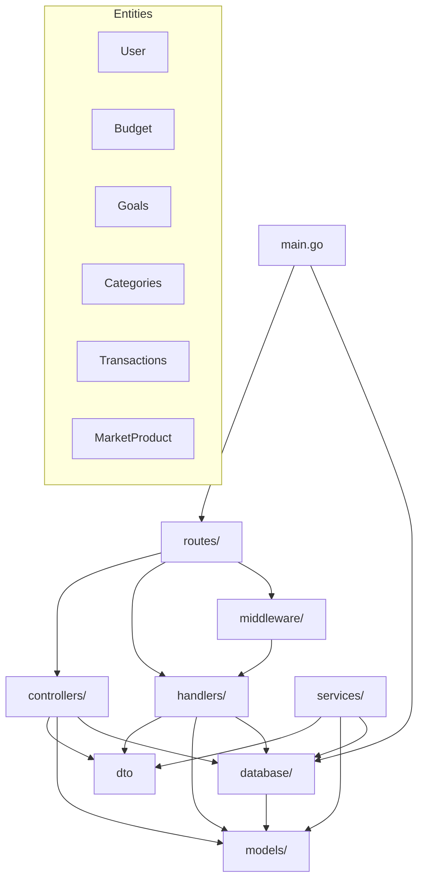

# Phinance

A RESTful API built with Go and the Gin framework for personal finance management — track budgets, transactions, categories, financial goals and market products.

## Getting Started

### Prerequisites

- Go 1.16+
- PostgreSQL
- Docker

### Installation

1. Clone the repository
2. Create a .env file in the root directory and add the following variables:

```
DB_USER=postgresql
DB_PASSWORD=password
DB_NAME=postgres
DB_HOST=localhost
DB_PORT=5432
JWT_SECRET=your_jwt_secret
```

3. Run the following command to start the database:

```
docker-compose up -d
```

4. Run the following command to install the dependencies:

```
go mod download
```

5. Run the following command to run the application:

```
go run main.go
```

## Architecture

The application is split into well-defined layers: HTTP routing, authentication middleware, controllers, services, DTOs and GORM models. The diagrams below illustrate how an incoming HTTP request flows through the system, how the components are wired together, and how the database entities relate to each other.

### Request Workflow



### Components Diagram



### Database Schema



### Module / Package Layout



## API endpoints

| Method | Endpoint                | Description                  |
| ------ | ----------------------- | ---------------------------- |
| POST   | /auth/login             | Authenticate and receive JWT |
| GET    | /users                  | Get all users                |
| POST   | /users                  | Create a new user            |
| GET    | /users/:id              | Get user by ID               |
| PUT    | /users/:id              | Update user                  |
| DELETE | /users/:id              | Delete user                  |
| GET    | /users/:id/goals        | List goals for a user        |
| POST   | /users/:id/goals        | Create a goal for a user     |
| GET    | /users/:id/goals/:goal_id | Get goal by ID             |
| PUT    | /users/:id/goals/:goal_id | Update goal                |
| DELETE | /users/:id/goals/:goal_id | Delete goal                |
| GET    | /users/:id/budgets      | List budgets for a user      |
| POST   | /users/:id/budgets      | Create a budget for a user   |
| GET    | /users/:id/budgets/:budget_id | Get budget by ID        |
| PUT    | /users/:id/budgets/:budget_id | Update budget           |
| DELETE | /users/:id/budgets/:budget_id | Delete budget           |
| GET    | /users/:id/transactions | List transactions for a user |
| POST   | /users/:id/transactions | Create a transaction         |
| GET    | /users/:id/transactions/:transaction_id | Get transaction by ID |
| DELETE | /users/:id/transactions/:transaction_id | Delete transaction     |
| GET    | /categories             | Get all categories           |
| POST   | /categories             | Create a new category        |
| GET    | /categories/:category_id | Get category by ID           |
| PUT    | /categories/:category_id | Update category              |
| DELETE | /categories/:category_id | Delete category              |
| GET    | /market-products        | Get all market products      |
| POST   | /market-products        | Create a new market product  |
| GET    | /market-products/:product_id | Get market product by ID     |
| PUT    | /market-products/:product_id | Update market product        |
| DELETE | /market-products/:product_id | Delete market product        |
