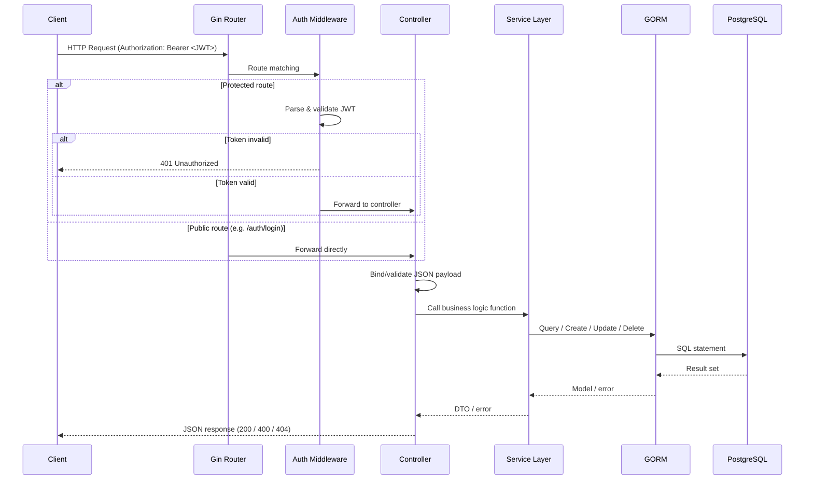
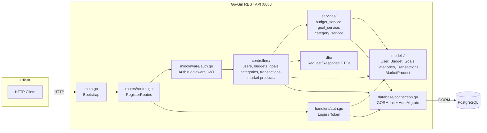
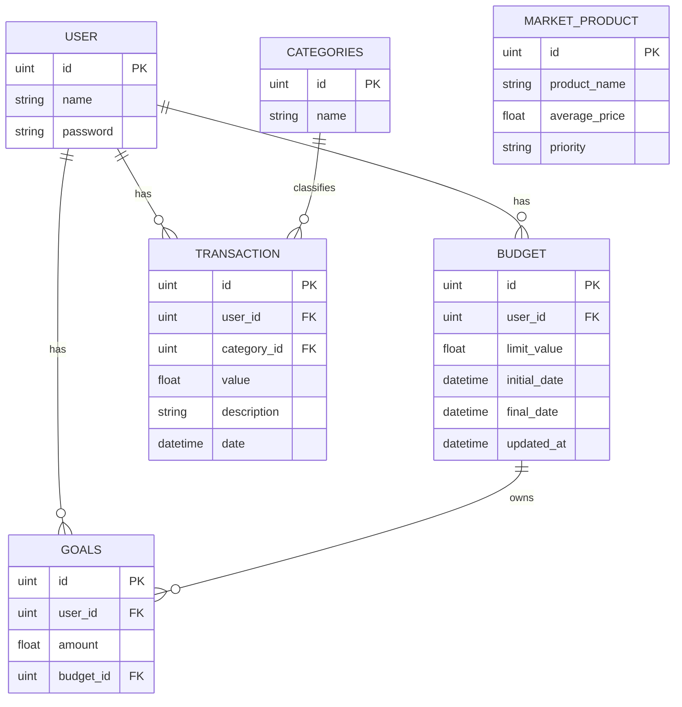

# Phinance

## Getting Started

### Prerequisites

- Go 1.16+
- PostgreSQL
- Docker

### Installation

1. Clone the repository
2. Create a .env file in the root directory and add the following variables:

```
DB_USER=postgresql
DB_PASSWORD=password
DB_NAME=postgres
DB_HOST=localhost
DB_PORT=5432
```

3. Run the following command to start the database:

```
docker-compose up -d
```

4. Run the following command to install the dependencies:

```
go mod download
```

5. Run the following command to run the application:

```
go run main.go
```

## Request workflow example:



## Components Diagram:



## Database Diagram:




## API endpoints

| Method | Endpoint                | Description                  |
| ------ | ----------------------- | ---------------------------- |
| GET    | /users                  | Get all users                |
| POST   | /users                  | Create a new user            |
| GET    | /users/:id              | Get user by ID               |
| PUT    | /users/:id              | Update user                  |
| DELETE | /users/:id              | Delete user                  |
| GET    | /categories             | Get all categories           |
| POST   | /categories             | Create a new category        |
| GET    | /categories/:category_id | Get category by ID           |
| PUT    | /categories/:category_id | Update category              |
| DELETE | /categories/:category_id | Delete category              |
| GET    | /market-products        | Get all market products      |
| POST   | /market-products        | Create a new market product  |
| GET    | /market-products/:product_id | Get market product by ID     |
| PUT    | /market-products/:product_id | Update market product        |
| DELETE | /market-products/:product_id | Delete market product        |
| GET    | /budgets                | Get all budgets              |
| POST   | /budgets                | Create a new budget          |
| GET    | /budgets/:budget_id     | Get budget by ID             |
| PUT    | /budgets/:budget_id     | Update budget                |
| DELETE | /budgets/:budget_id     | Delete budget                |
| GET    | /goals                  | Get all goals                |
| POST   | /goals                  | Create a new goal            |
| GET    | /goals/:goal_id         | Get goal by ID               |
| PUT    | /goals/:goal_id         | Update goal                  |
| DELETE | /goals/:goal_id         | Delete goal                  |
| GET    | /transactions           | Get all transactions         |
| POST   | /transactions           | Create a new transaction     |
| GET    | /transactions/:transaction_id | Get transaction by ID       |
| PUT    | /transactions/:transaction_id | Update transaction          |
| DELETE | /transactions/:transaction_id | Delete transaction          |
